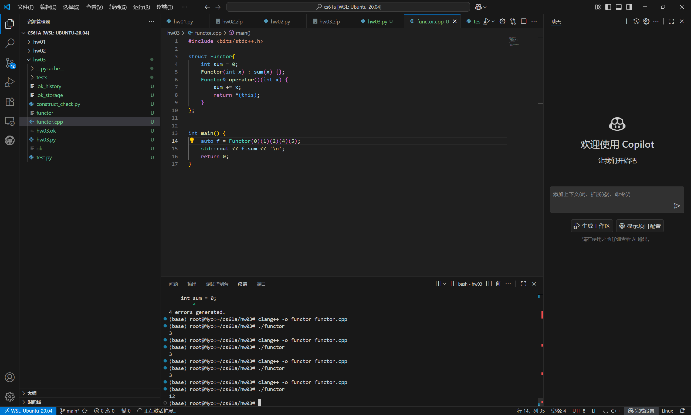

cs61a提到了柯里化，在hw03的最后一题`make_anonymous_factorial()`中：

```python
def make_anonymous_factorial():

    """Return the value of an expression that computes factorial. 
    >>> make_anonymous_factorial()(5)
    120
    >>> from construct_check import check
    >>> # ban any assignments or recursion
    >>> check(HW_SOURCE_FILE, 'make_anonymous_factorial',
    ...     ['Assign', 'AnnAssign', 'AugAssign', 'NamedExpr', 'FunctionDef', 'Recursion'])
    True
    """
    return (lambda f: lambda n:
        1 if n == 1 else n * f(f)(n - 1)
    )(lambda f: lambda n:
        1 if n == 1 else n * f(f)(n - 1)
    )
```

得知此类写法叫做柯里化，上网搜索相关资料，获得了一定的理解。

柯里化就是让单参函数接受多个参数的方法，具体表现为：在函数内部定义新函数，上面的py代码使用lambda匿名函数达到相同的效果。

但是我没看明白，为什么不能写成`return lambda f: lambda n: 1 if n == 1 else n * f(n - 1)`.运行check程序后提示
```
Traceback (most recent call last):
  File "/root/cs61a/hw03/hw03.py", line 219, in <lambda>
    1 if n == 1 else n * f(n - 1)
                     ~~^~~~~~~~~~
TypeError: unsupported operand type(s) for *: 'int' and 'function'

# Error: expected
#     120
# but got
#     Traceback (most recent call last):
#       ...
#     TypeError: unsupported operand type(s) for *: 'int' and 'function'
```

有一说一，还是没有太理解。

又找视频看，想知道cpp能否进行类似操作，[就找到了这个视频](https://www.bilibili.com/video/BV1Dg411p7ri)

然后看到了更有意思的东西：

```cpp
#include <bits/stdc++.h>

struct Functor {
    int sum = 0;
    Functor(int x): sum(x) {};
    Functor & operator()(int x) {
        sum += x;
        return * (this);
    }
};


int main() {
    auto f = Functor(0)(1)(2);
    std::cout << f.sum << '\n';
    return 0;
}
```


这里的链式调用太优雅了！

搞懂了不少东西，但看原先py那边的lambda表达式还是有点雾水。

使用构造函数让其返回Functor的引用，返回的又是一个Functor对象，从而可以继续调用重载的括号。这里使用引用而不是创建新对象是考虑到了内存问题，不创建新对象而优化内存，又是一个小细节。



继续看cpp的柯里化——

实际上根据py的lambda表达式也可以举一反三：

```cpp
auto addn(int x) {
    auto coef = [x](int y) -> int {
        return x + y;
    };
    return coef;
}
std::cout << addn(1)(100) << "\n";
//101
```

就是这样的调用。

### 「操作符重载以及定义隐式类型转换」

占个位置，知识点++

```cpp
friend bool operator == (int lhs,
    const Functor & rhs) {
    return lhs == rhs.sum;
}
friend int operator + (const Functor & lhs, int rhs) {
    return lhs.sum + rhs;
}
friend int operator - (const Functor & lhs, int rhs) {
    return lhs.sum - rhs;
}
```

刚开始我很疑惑为什么操作符重载要用友元，问了一下gpt

> - **成员函数**：只能用于 `Functor == int`，左边是 Functor。  
> - **非成员函数（friend）**：可以用于 `int == Functor`，左边是 int。  
> -  **friend** 的作用主要是方便访问私有成员，并让函数和类紧密绑定在一起。 

让我们再看一下普通的重载是什么样的
```cpp
bool operator==(int lhs) const{
	return this->sum == lhs;
}
```

一目了然了。放在类里面，默认有一个 `this` 指针作为隐式参数，所以只能写一个参数。

让我们看看gpt的解释：
> - **普通成员函数**：一个参数，`this` 隐式。  
> - **两个参数的函数**（比如 `int == Functor`）：必须是 **非成员函数**，可以放在类外，也可以放在类内加 `friend`。  
> - 如果你直接在类里面写 `bool operator==(int lhs, const Functor& rhs)` 而不加 `friend`，编译器会认为你是在定义 **成员函数**，于是 `this` + 两个参数 → “参数过多”。

以上是操作符重载的一些东西。

```cpp
#include <bits/stdc++.h>


struct Functor{
    int sum = 0;
    Functor(int x) : sum(x) {};
    Functor& operator()(int x) {
        sum += x;
        return *(this);
    }
    operator int() {
        return this -> sum;
    }
};

  

auto add(int n) {
    return Functor(n);
}

int main() {
    std::cout << (3 + add(1)(2)(3)) << "\n";
    std::cout << (add(1)(2)(3) + 100) << "\n";
    std::cout << (add(1)(2)(3) << 1) << "\n";
    return 0;

}
```

是什么呢？

就是这关键的一个重载——
```cpp
operator int() {
	return this -> sum;
}
```

隐式转换重载。

问了一下gpt，这个方面的内容也大概补充了一些。

cpp允许重载多种隐式类型转换，因此，这样的写法是合法的：

```cpp
struct Functor {
    int sum = 0;
    Functor(int x) : sum(x) {}

    operator int() { return sum; }
    operator double() { return sum * 1.0; }
};

Functor f(10);
int x = f;      // 调用 operator int()
double y = f;   // 调用 operator double()

```

cpp还有一个关键字叫`explicit`，作用就是禁止隐式转换，只可进行显式类型转换。

> `explicit` 的作用就是 **阻止编译器自动进行类型转换**，减少意外的类型转换和二义性。

假设你有一个类 `Functor`，你想让它既可以转换为 `int`，也可以转换为 `double`：

```cpp
struct Functor {
    int sum = 0;
    Functor(int x) : sum(x) {}

	explicit operator int() { return sum; }
	operator double() { return sum * 1.0; }

};

//这样，只能显式调用int类型转换，而可以隐式调用double类型转换
Functor f(10);
int x = static_cast<int>(f);
double y = f;

```


感觉写得蛮详尽了，先这样。

又是一个小细节：

```cpp
operator int() {
    return sum;
}
//没有加const修饰,只能在非const对象上调用：

Functor f(10);
int x = f;  // ✅ OK

const Functor cf(20);
int y = cf; // ❌ 编译错误，不能在 const 对象上调用

```

而
```cpp
operator int() const {
    return sum;
}

const Functor cf(20);
int y = cf; // ✅ OK
```

加上 `const`，可以在 **const 对象** 上调用，同时也能在非 const 对象上调用，完全向后兼容。

又是一个小细节系列。

> **类型转换运算符通常应该加 `const`**，因为把对象转成 `int` 只是读取值，不应该修改对象。  
> 这是 C++ 编程的 **良好习惯**，提高代码安全性和可读性。
